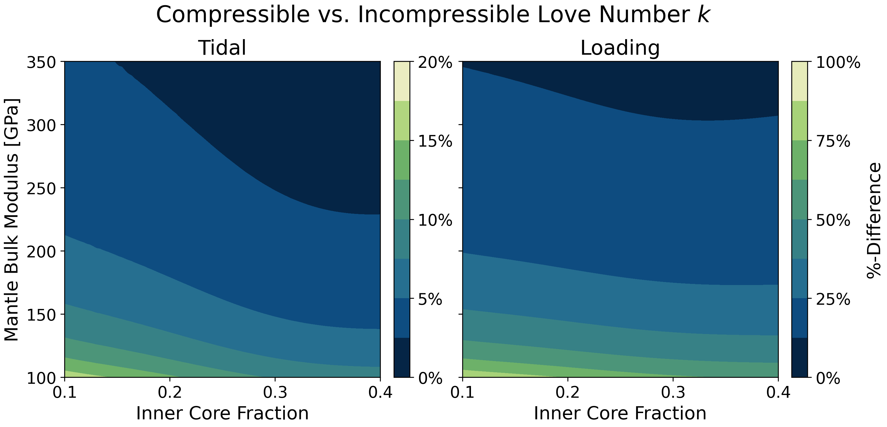
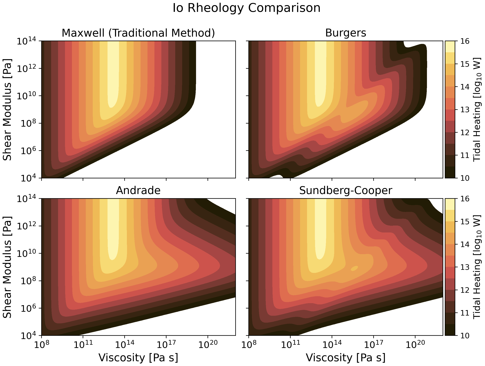
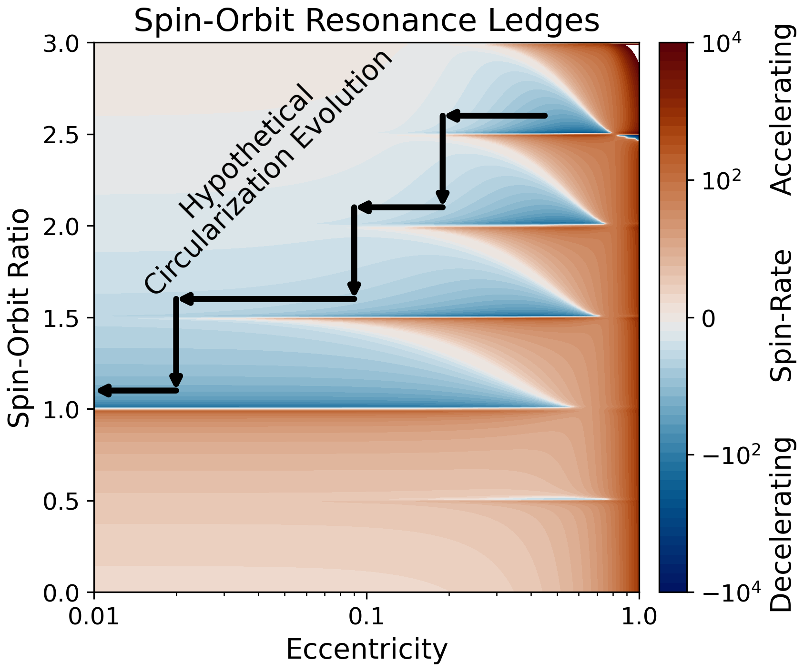
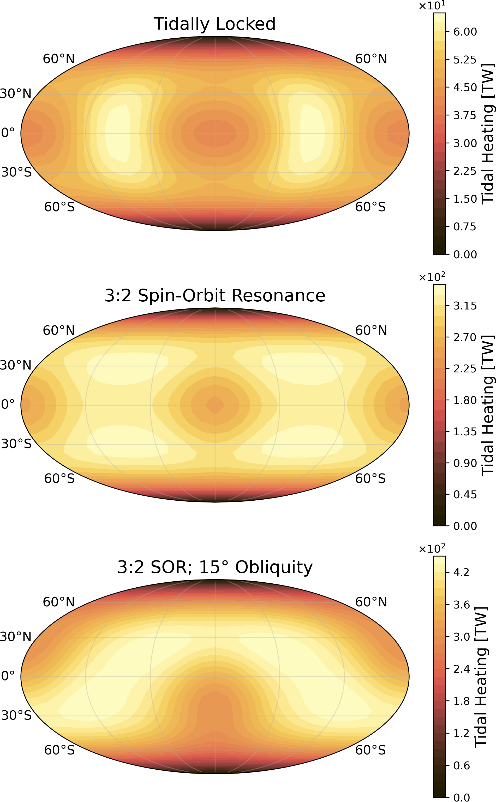

# Summary

`TidalPy` is an open-source Python package designed to model tidal heating, interior response, and long-term spin–orbit
evolution of planets and moons across the Solar System and beyond. It combines Love number computation, advanced
rheological models, and semi-analytical orbital dynamics into a single accessible framework with performance-critical
components in C++ and Cython. The software enables forward modeling of interior structure, dissipation mechanisms,
and tidal feedback on rotation and orbits, supporting applications ranging from Solar System geophysics to exoplanet
characterization. TidalPy interfaces with the broader Python scientific ecosystem, offers extensive documentation and
examples, and has already been applied in multiple planetary science studies.

# Statement of need

`TidalPy` provides a flexible, accessible, and performant toolkit for solving problems in tides and tidal dynamics.
The same tides that cause Earth's oceans to rise twice each day can churn the interiors of other planets and moons to
the point that significant fractions of their bulk can melt, greatly altering their long-term thermal evolution.
The energy that drives this heat originates in the orbits and rotations of the world and its host, which are
also altered on geologic timescales. TidalPy provides functions and frameworks to apply the latest tidal modeling
theories and methods to a wide variety of Solar System and exoplanetary worlds. Written for the Python ecosystem,
TidalPy can easily interface with other popular packages used in planetary science and astronomy. This 
enables fast production of advanced simulations which can be used directly or as a benchmark against other models and 
tools.

# Overview

TidalPy is written primarily in Python, with performance-critical components implemented in C++ and Cython [@cython].
Its API is designed to be intuitive and consistent with modern conventions, enabling both early career and experienced
researchers to quickly learn its syntax and incorporate it in their scientific projects. TidalPy complements a robust
community of other packages that perform similar or parallel calculations
[@alma3; @pyalma; @loaddef; @Qin+2014nov; @icydwarf; @VPLanet; @reboundx_tides; @Rovira-Navarro+2024maya]
and expands on this prior work in three major areas described in the following sections.

TidalPy has been vetted and used in investigations of tides on Earth [@Vidal2025], in our Solar System
[@Cascioli2023; @Goossens2024; @Wagner2025], and beyond [@RenaudHenning2018apr; @Renaud2021; @Fauchez2025].
Documentation and Jupyter Notebook [@jupyter] demonstrations are available on the
[GitHub repository](https://github.com/jrenaud90/TidalPy), these are continuously added to and updated as TidalPy
evolves. Future releases will focus on increasing performance, improving usability, and incorporating more physics.
Get started using TidalPy by visiting [https://tidalpy.info](https://tidalpy.info).

## Love Number Solver (RadialSolver Module)

_Learn more about TidalPy's RadialSolver Module [here](REF)._

**Love Numbers** quantify a planet or moon's ability to respond to tidal or loading forces [@love1911; @shida1912].
They are dynamic and depend on many physical factors such as a world's thermal state, physical structures (e.g.,
a presence of a solid or liquid core), past stress events, and orbit/spin state. These numbers can be measured, albeit
with difficulty particularly if no spacecraft flyby or orbiter is available. Therefore, it is useful to perform
forward modeling utilizing our best estimates of a world's structure and composition to provide a range of values to
constrain a world's response efficiency.

TidalPy provides a Love number solver that uses information about a world's interior structure and thermal state to
find these values. A user can turn on or off a variety of assumptions to determine their impact. This solver can
be used in other modules to, for example, determine the effect of long-term heating on a world's tidal dissipation or
in 3rd party packages such as @emcee's Markov Chain Monte-Carlo code to predict a statistically likely interior. 

{ width=50% }

TidalPy's solver uses a shooting method [@TakeuchiSaito1972] to find tidal and loading Love numbers. This approach is
advantageous as it enables more advanced physics, providing a more accurate description of a world. Specifically,
TidalPy's solver allows for: liquid layers and oceans, dynamic tides (See \autoref{fig:dynamic}), and bulk
compressibility (See \autoref{fig:compressibility}). This additional physics has been shown to be important for
certain worlds during certain epochs. TidalPy's Love number solver has been benchmarked against others tools that
provide some of the same functionality including `ALMA3` [@alma3; @pyalma] and `LoadDef` [@loaddef].
Other tools exist that, unlike the current version of TidalPy, can calculate multidimensional Love numbers
[@Qin+2014nov; @Rovira-Navarro+2024maya; @Berne+2023nov].

{ width=50% }

## Advanced Rheological Modeling (Rheology Module)

_Learn more about TidalPy's Rheology Module [here](REF)._

The calculation of tidal Love numbers requires knowing the viscoelastic state of a planet. This can be described
through the shear and bulk modulus as well as the shear and bulk viscosity. The former describe how sound waves travel
through a planet's bulk; the latter describe how material flows on long timescales. Linking these properties to tides
requires making assumptions about the dominant mechanism driving dissipation in the rocks and ices
[@RenaudHenning2018apr; @Bagheri+2022aug]. For example, microscopic grains of ice will tend to move more freely than
larger solid crystalline chunks. Likewise, rock that has experienced significant fracturing or is porous tends to have
more opportunity to create frictional heat then it would otherwise. The choice of **Rheology** determines which
dissipation mechanism is dominant within a world. 

{ width=50% }

TidalPy provides several different rheological models in its Rheology Module (See a subset in \autoref{fig:rheology}).
Most rheologies have empirical parameters which are relatively unknown for rocks and ices at planetary temperatures
and pressures. TidalPy suggests typical values used in the literature but allows you to vary them. These efficient
rheological functions can be used with other TidalPy methods, like the Love number solver, or in your own scripts
alongside other tools. 

## Spin and Orbital Evolution (Dynamics Module)

_Learn more about TidalPy's Dynamics Module [here](REF)._

The energy released as heat in a tidally active world originates in its orbit or in the rotation of it or its tidal
host (which could be Jupiter in the case of Io, or a star in the case of a short-period exoplanet). Energy can be
exchanged between adjacent planets and moons, further increasing the complexity of the
problem [_e.g._, @HussmannSpohn2004oct]. Different orbit and spin configurations will have a variety of forcing
frequencies which can act like a tuning fork, dramatically increasing dissipation in narrow frequency bands
[@RenaudHenning2018apr; @Bagheri+2022aug]. Likewise, troughs in dissipation can slow or stop the evolution of a world
for millions of years. These "Spin-Orbit Resonances" are what drive Mercury's 3:2 Spin to Orbit ratio and what leads to
systems like Pluto-Charon which are in a "dual-synchronous" configuration, the ultimate end state of tidal evolution.

{ width=50% }

To calculate these effects, TidalPy uses a semi-analytical Fourier decomposition model that has a long history of use
in the field [_e.g._, @Kaula1964] and recently expanded by [@BoueEfroimsky2019jul]. In this framework, TidalPy can track
dissipation within both the target planet and host (dual body dissipation) and can be integrated with semi-analytical
models to capture multi-body systems, like the Laplace Resonance found in the Galilean moons [@HussmannSpohn2004oct].
The rotation rate of all targets is tracked such that spin-orbit resonance capture potential can be determined (See
\autoref{fig:sor}). TidalPy can also generate 3-dimensional stress and heating maps which can be used to determine
locations where tidal heating is maximum (See \autoref{fig:3dmaps}).

{ width=50% }

# Availability

TidalPy's source code is available and kept up to date on its [GitHub Repository](https://github.com/jrenaud90/TidalPy).
All versions are released on GitHub as well as on [PyPI](https://pypi.org/project/TidalPy/) and
[Conda-Forge](https://anaconda.org/channels/conda-forge/packages/tidalpy). Major versions are also released with
dedicated DOIs on TidalPy's [Zenodo page](https://zenodo.org/records/10656488). Anyone is welcome to open pull requests,
create forks, or issue bug reports, suggestions, and questions. The latter can be made on the
[GitHub issue tracker](https://github.com/jrenaud90/TidalPy/issues). TidalPy can also be found on NASA's 
[Exoplanet Modeling and Analysis Center](https://emac.gsfc.nasa.gov/?cid=2207-034) [@emac].

All figures made for this paper were done using TidalPy and other packages listed in the acknowledgements. The scripts
used to make these figures can be found on TidalPy's [GitHub repository](https://github.com/jrenaud90/TidalPy/tree/main/Papers/2025-JOSS).

## License

TidalPy is licensed under Creative Commons Attribution-ShareAlike (CC BY-SA). This allows any user to share and reproduce
TidalPy in whole or in part, as long as attribution is made back to the original repository and cites this paper.
All adapted versions must carry a similar license (share alike). Full details about the license can be found in the
[repository's license file](https://github.com/jrenaud90/TidalPy/blob/main/LICENSE.md).

# Acknowledgements

TidalPy benefited greatly from conversations, code contributions, and testing performed by many in the community.
We would like to specifically thank Wade G. Henning, Michael Efroimsky, Michaela Walterová, Sander Goossens,
Marc Neveu, Nick Wagner, and Gael Cascioli. The development of TidalPy was supported by NASA Sellers' Exoplanet
Environments Collaboration and Planetary Geodesy ISFMs. J. Renaud was additionally supported during its development
by the CRESST-II cooperative agreement (NASA award 80GSFC24M0006). TidalPy makes extensive use of the following
software: [CyRK](https://github.com/jrenaud90/CyRK) [@cyrk], [BurnMan](https://github.com/geodynamics/burnman)
[@burnman], [NumPy](https://github.com/numpy/numpy) [@numpy], [SciPy](https://github.com/scipy/scipy) [@scipy],
[Numba](https://github.com/numba/numba) [@numba], [Cython](https://github.com/cython/cython) [@cython],
[Matplotlib](https://github.com/matplotlib/matplotlib) [@matplotlib], [SymPy](https://github.com/sympy/sympy) [@sympy],
[Jupyter](https://github.com/jupyter/jupyter) [@jupyter],
and [cmcrameri](https://github.com/callumrollo/cmcrameri) [@cmcrameri; @scicmap].

# References