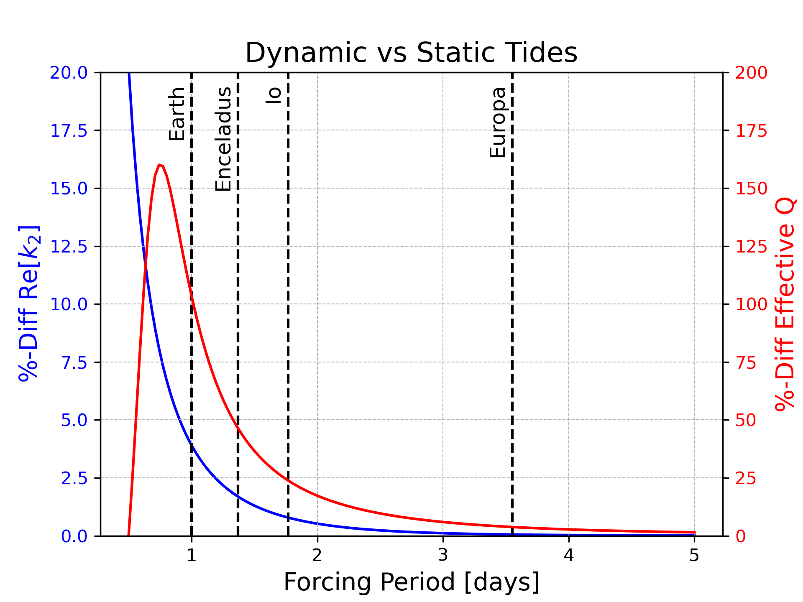
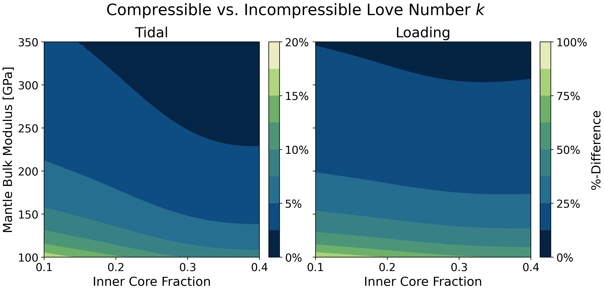
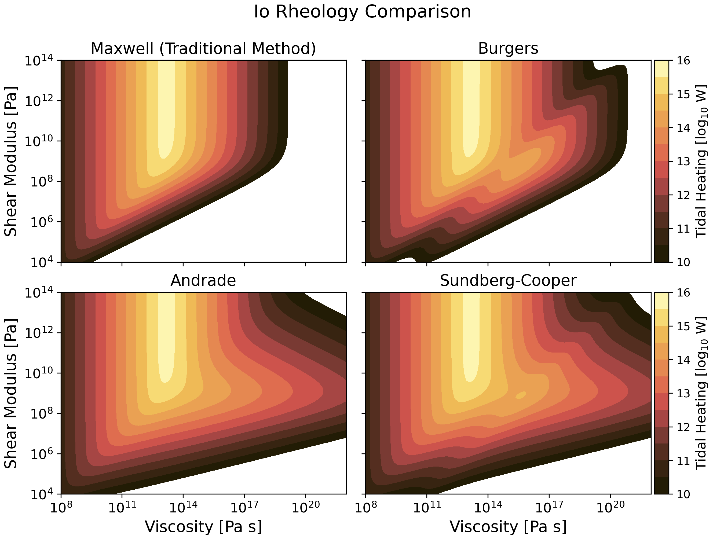
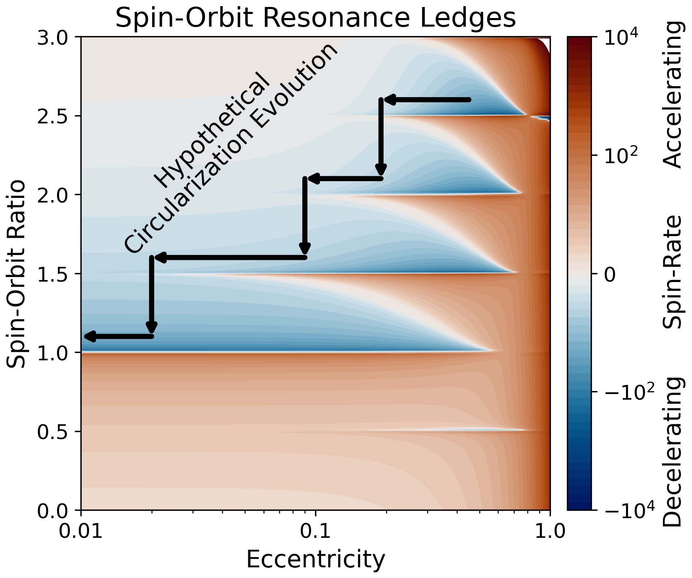
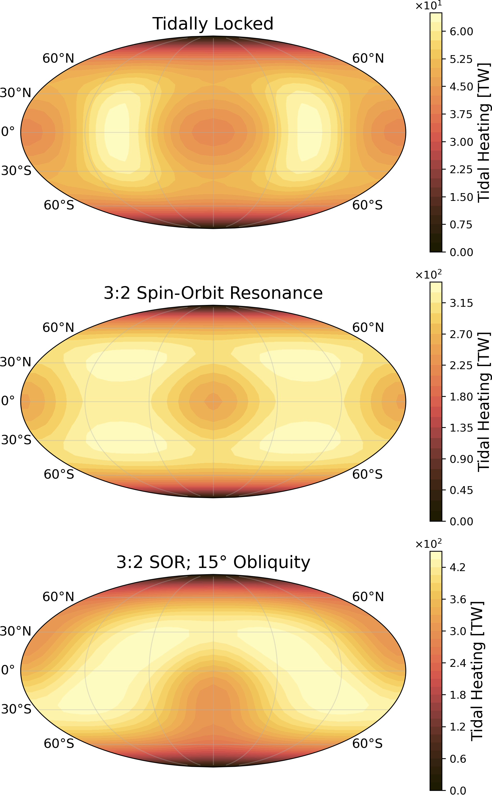

# Summary

`TidalPy` is an open-source Python package designed to model tidal heating, interior response, and long-term spin–orbit evolution of planets and moons across the Solar System and beyond. It combines Love number computation, advanced rheological models, and semi-analytical orbital dynamics into a single accessible framework with performance-critical components in C++. The software enables forward modeling of interior structure, dissipation mechanisms, and tidal feedback on rotation and orbits, supporting applications ranging from Solar System geophysics to exoplanet characterization. TidalPy interfaces with the broader Python scientific ecosystem, offers extensive documentation and examples, and has been applied in multiple planetary science studies.

# Statement of need

`TidalPy` provides a flexible, accessible, and performant toolkit for solving problems in tides and tidal dynamics. This is done through functions and frameworks that utilize the latest tidal modeling theories and methods with applications to a wide variety of Solar System and exoplanetary worlds. Written for the Python ecosystem, TidalPy can easily interface with other popular scientific packages. This enables fast production of advanced simulations which can be used directly or as a benchmark against other models and tools. Its API is designed to be intuitive and consistent with modern conventions, enabling both early career and experienced researchers to quickly learn its syntax and incorporate it in their projects. TidalPy expands on the state-of-the-art in three major areas described in the following sections.

## Love Number Solver (RadialSolver Module)

_Learn more about TidalPy's RadialSolver Module [here](https://tidalpy.readthedocs.io/en/latest/RadialSolver/index.html)._

**Love Numbers** quantify a planet or moon's ability to respond to tidal or loading forces [@love1911; @shida1912]. They are dynamic and depend on many physical factors such as a world's thermal state and physical structures (e.g., a presence of a solid or liquid core). These numbers can be measured, albeit with difficulty. Therefore, it is useful to perform forward modeling utilizing the best estimate of a world's structure and composition to provide a range of values to constrain a world's response efficiency.

TidalPy provides several varieties of Love number solvers that uses information about a world's state to find these values. A user can turn on or off a variety of assumptions to determine their outcome. These solvers can be used in other modules to, for example, determine the effect of long-term heating on a world's tidal dissipation or in 3rd party packages such as @emcee's Markov Chain Monte-Carlo code to predict a statistically likely interior. 

{ width=65% }

TidalPy's most advanced solver uses a shooting method [@TakeuchiSaito1972] to find tidal and loading Love numbers. This approach is advantageous as it enables more advanced physics, providing a more accurate description of a world. Specifically, TidalPy's solver allows for: liquid layers and oceans, dynamic tides (See \autoref{fig:dynamic}), and bulk compressibility (See \autoref{fig:compressibility}). This additional physics has been shown to be important for certain worlds during certain epochs.

{ width=100% }

## Advanced Rheological Modeling (Rheology Module)

_Learn more about TidalPy's Rheology Module [here](https://tidalpy.readthedocs.io/en/latest/Rheology/index.html)._

The calculation of tidal Love numbers requires knowing the viscoelastic state of a planet. This is described through the shear and bulk moduli and viscosities. The former describe how sound waves travel through a planet's bulk; the latter describe how material flows on long timescales. Linking these properties to tides requires making assumptions about the dominant mechanism driving dissipation in the rocks and ices [@RenaudHenning2018apr; @Bagheri+2022aug]. For example, microscopic grains of ice will tend to move more freely than larger solid crystalline chunks. Likewise, rock that has experienced significant fracturing or is porous tends to have more opportunity to create frictional heat then it would otherwise. The choice of **Rheology** determines which dissipation mechanism is dominant within a world. 

{ width=80% }

TidalPy provides several different rheological models in its Rheology Module (See \autoref{fig:rheology}). Most rheologies have empirical parameters which are relatively unknown for rocks and ices at planetary temperatures and pressures. TidalPy suggests typical values used in the literature but allows you to vary them. These efficient rheological functions can be used with other TidalPy methods, like the Love number solver, or in your own scripts alongside other tools. 

## Spin and Orbital Evolution (Dynamics Module)

_Learn more about TidalPy's Dynamics Module [here](https://tidalpy.readthedocs.io/en/latest/Dynamics/index.html)._

The energy released as heat in a tidally active world originates in its orbit or in the rotation of it or its tidal host (which could be Jupiter in the case of Io, or a star in the case of a short-period exoplanet). Energy can be exchanged between adjacent planets and moons, further increasing the complexity of the problem [_e.g._, @HussmannSpohn2004oct]. Different orbit and spin configurations will have a variety of forcing frequencies which can act like a tuning fork, dramatically increasing dissipation in narrow frequency bands [@RenaudHenning2018apr; @Bagheri+2022aug]. Likewise, troughs in dissipation can slow or stop the evolution of a world for millions of years. These "Spin-Orbit Resonances" are what drive Mercury's 3:2 Spin to Orbit ratio and what leads to systems like Pluto-Charon which are in a "dual-synchronous" configuration, the ultimate end state of tidal evolution.

{ width=50% }

To calculate these effects, TidalPy uses a semi-analytical Fourier decomposition model that has a long history of use in the field [_e.g._, @Kaula1964] and expanded by [@BoueEfroimsky2019jul]. In this framework, TidalPy can track dissipation within both the target planet and host and can be integrated with semi-analytical models to capture multi-body systems, like the Laplace Resonance found in the Galilean moons [@HussmannSpohn2004oct]. The rotation rate of all targets is tracked such that spin-orbit resonance capture potential can be determined (See \autoref{fig:sor}). TidalPy can also generate 3-dimensional stress and heating maps which can be used to determine locations where tidal heating is maximum (See \autoref{fig:3dmaps}).

{ width=50% }

# State of the field

TidalPy complements a variety of other packages that perform similar or parallel calculations [@alma3; @pyalma; @loaddef; @Qin+2014nov; @icydwarf; @VPLanet; @reboundx_tides; @Rovira-Navarro+2024maya]. TidalPy's Love number solver has been benchmarked against other tools that provide some of the same functionality including `ALMA3` [@alma3; @pyalma] and `LoadDef` [@loaddef], and its interior equation of state solver has been benchmarked against `BurnMan` [@burnman]. TidalPy was built because these types of problems need the interior response, the rheology behind it, and the resulting spin-orbit evolution to interconnect, allowing the long-term thermal-orbital evolution of a world to be simulated efficiently without switching between codes.

# Software design

TidalPy is written for Python users, but starting in version 0.5 and greatly expanding in v0.8, its computational core is C++, exposed via thin Cython [@cython] wrappers. Python still handles configuration, file input and output, and plotting. All calculations are done at the C++ level in a thread-safe way. This enables very fast, parallelized workflows while still allowing users to interconnect TidalPy to other popular scientific Python packages.

A planet, moon, or star (collectively referred to as "worlds") are built from layers, each holding interchangeable models for its rheology, viscosity, partial melting, cooling, radiogenic heating, and equation of state. Every one of these physics models are C++ classes which share common functionality through a TidalPy abstract class. Each can solve their specific tasks using a combination of values passed from a user and state properties of the layer or planet they are attached to. These classes are built from, and can be saved to, both human-readable TOML files and machine-readable binary files. Researchers need only share these configuration files and the version of TidalPy used to allow others in the field to reproduce their work.

# Research impact statement

TidalPy has been vetted and used in investigations of tides on Earth [@Vidal2025], in our Solar System [@RenaudHenning2018; @Cascioli2023; @Goossens2024; @Wagner2024], and beyond [@RenaudHenning2018apr; @Renaud2021; @Fauchez2025]. TidalPy can also be found on NASA's [Exoplanet Modeling and Analysis Center](https://emac.gsfc.nasa.gov/?cid=2207-034) [@emac]. Its test suite, benchmarks, and demos run on Linux, macOS, and Windows. TidalPy has been in development since 2017 and its tests share heritage with that earlier work. 

Documentation and Jupyter Notebook [@jupyter] demonstrations are available on the [GitHub repository](https://github.com/jrenaud90/TidalPy), these are continuously added to and updated as TidalPy evolves. The scripts used to make these figures can be found on TidalPy's [GitHub repository](https://github.com/jrenaud90/TidalPy/tree/main/Papers/2025-JOSS).

## Availability

TidalPy's source code is available and kept up to date on its [GitHub Repository](https://github.com/jrenaud90/TidalPy). All versions are released on GitHub as well as on [PyPI](https://pypi.org/project/TidalPy/) and [Conda-Forge](https://anaconda.org/channels/conda-forge/packages/tidalpy). Major versions are also released with dedicated DOIs on TidalPy's [Zenodo page](https://zenodo.org/records/10656488). Anyone is welcome to open pull requests, create forks, or post bug reports, suggestions, and questions on the [GitHub issue tracker](https://github.com/jrenaud90/TidalPy/issues).

TidalPy is licensed under the [Apache 2.0 License (Apache-2.0)](https://www.apache.org/licenses/LICENSE-2.0). Full details can be found in the repository's [license](https://github.com/jrenaud90/TidalPy/blob/main/LICENSE.md) and
[notice](https://github.com/jrenaud90/TidalPy/blob/main/NOTICE) files.

# AI usage disclosure

Generative AI was used in the development of TidalPy since v0.7.5 to help refactor code, write tests, and expand documentation. The authors directed this work and reviewed its changes. Correctness was checked against TidalPy's already extensive pre-existing test suite as well as against published or analytical results. The overall structure, purpose, and style of the package was, for better or worse, designed and written by the primary author.

# Acknowledgements

TidalPy benefited greatly from conversations, code contributions, and testing performed by many in the community. We would like to specifically thank Wade G. Henning, Michael Efroimsky, Michaela Walterová, Sander Goossens, Marc Neveu, Nick Wagner, and Gael Cascioli. The development of TidalPy was supported by NASA Sellers' Exoplanet Environments Collaboration and Planetary Geodesy ISFMs. J. Renaud was additionally supported during its development by the CRESST-II cooperative agreement (NASA award 80GSFC24M0006). TidalPy makes extensive use of the following software: [CyRK](https://github.com/jrenaud90/CyRK) [@cyrk], [NumPy](https://github.com/numpy/numpy) [@numpy], [SciPy](https://github.com/scipy/scipy) [@scipy], [Cython](https://github.com/cython/cython) [@cython], [Eigen](https://gitlab.com/libeigen/eigen) [@eigen], [spdlog](https://github.com/gabime/spdlog), [xsf](https://github.com/scipy/xsf), [Matplotlib](https://github.com/matplotlib/matplotlib) [@matplotlib], [SymPy](https://github.com/sympy/sympy) [@sympy], [Jupyter](https://github.com/jupyter/jupyter) [@jupyter], and [cmcrameri](https://github.com/callumrollo/cmcrameri) [@cmcrameri; @scicmap].

# References
